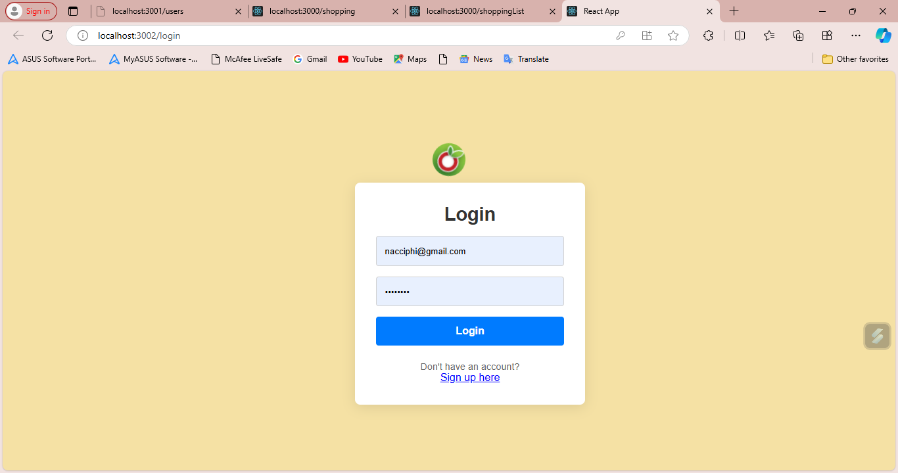

# Shopping List App

## Overview

The **Shopping List App** is a user-friendly web application built using React and Redux, designed to help users manage their shopping lists efficiently. With features that allow users to add, edit, and delete items, this app simplifies the shopping experience while ensuring that all data is securely managed using `json-server` as a mock backend.

## Features

- **Add Items**: Easily add items to your shopping list with details like name, price, and weight (in kilograms).
- **Edit Items**: Update existing items quickly to reflect any changes in your shopping needs.
- **Delete Items**: Remove items from your list when they are no longer needed.
- **Input Validation**: Ensure that all inputs for price and weight are valid before submission.
- **Real-Time Updates**: Instant updates to the shopping list using a mock backend provided by `json-server`.

## Installation

### Prerequisites

### Technologies

- Node.js (version 12 or above)
- npm (version 6 or above)
- `json-server` (for serving the mock API)
## Screenshots

### Home Page


### Add Item Form


### Edit Item


### Steps to Install

1. ** Repository**:
   ```bash
   git clone https://github.com/Siphe23/shopping-list-app.git
   cd shopping-list-app
